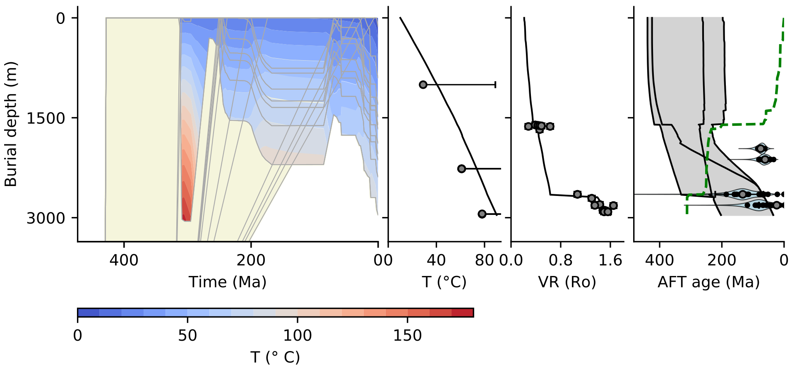
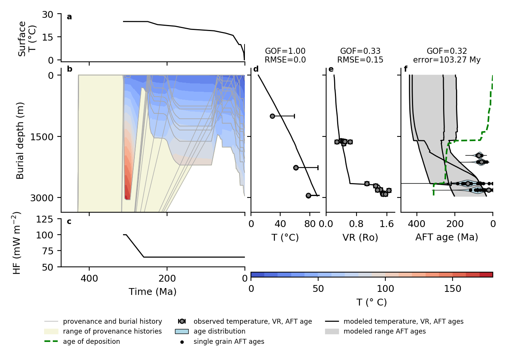
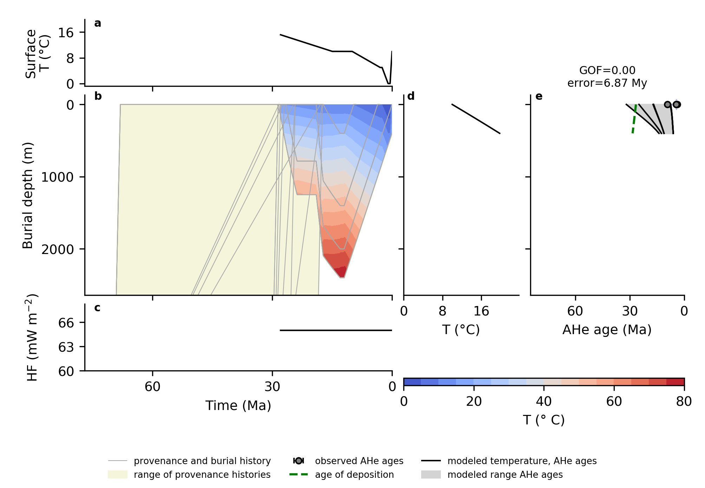

# Introduction

PyBasin is an open-source basin model code that simulates sediment burial, compaction and thermal history. The modeled geological and thermal history can be compared to vitrinite reflectance data and the low-temperature thermochronometers apatite fission track and (U-Th)/He. The code includes support for setting up and running large series of model runs using parallel computing, which is useful for instance to explore the values of exhumation rate, timing or basal heat flow that match organic maturity or thermochronology data in a basin. 

PyBasin was first written during my PhD research on the thermal history of the Roer Valley Graben to solve a key issue with interpreting low-temperature thermochronology in sedimentary basins, which is that themrochronometers often show inhereited signals from their sediment source areas. This makes modeling themrochronometers much more challenging, and most available themrla history models implicitely assume that your sample contains a homogenous population with a single thermal history and source area. PyBasin solves this by using end-member provenance hsitories and modeling a range of thermochronometer ages, which can then be compared with the distribution of ages in samples. You can find more background information and case studies of the models in a publication in JGR [@Luijendijk2011b], my PhD thesis [@Luijendijk2012] and an upcoming publication in Geoscientific Model Development.


**Figure 1** *Example model run showing provenance and basin burial and temperature history (left-hand panel) and modeled present-day subsurface temperature, vitrinite reflectance and apatite fission track ages.*


# Getting started

* The latest source code for PyBasin can be found on Github:<https://github.com/ElcoLuijendijk/pybasin>. Download the source code as a zip file or clone the repository to get the model code.
* Make sure you have installed the necessary python modules (see list below). The easiest is to use a python distribution that already includes all the necessary modules, like Anaconda (<https://www.continuum.io/downloads>), pythonxy (<https://code.google.com/p/pythonxy/>) or canopy (<https://www.enthought.com/products/canopy/>).
* Navigate to the directory where you have saved PyBasin and run PyBasin by executing the following command from the command line:

````sh
python pybasin.py
`````
	

* The model will now run with a default input dataset from the Roer Valley Graben. While running the model will generate screen output on things like which timestep is currently underway and what are the modelled temperatures. After the model is done you can check figures and .csv file output generated by the model in the directory ``model_output/example_dataset_1``
* Optional: PyBasin includes a version of the fission track module that is written in Fortran instead of Python. The Fortran version runs much faster than the relatively slow Python version. However, the Fortran module needs to be compiled first to be able to use it. Compile the Fortran file by navigating to the subdirectory ``lib``, opening a terminal and running the following command:

````sh
f2py -c calculate_reduced_AFT_lengths.f90 -m calculate_reduced_AFT_lengths
`````
	

* To use the Fortran version of the fission track annealing library you may need to install a Fortran compiler first. For Linux operating systems this should be included in your distribution, for Mac OSX you can find installers for Gfortran here: <https://gcc.gnu.org/wiki/GFortranBinariesMacOS>. I have not tested compiling Fortran code on windows systems. Note that you do not need to compile anything to model vitrinite reflectance and apatite (U-Th)/He data.


## Required modules

PyBasin requires the following Python packages:

- Numpy: <http://www.numpy.org/>
- Pandas: <https://pandas.pydata.org/>
- Scipy: <https://www.scipy.org/>
- Matplotlib: <https://matplotlib.org/>

## Running single or multiple models

The command for running pybasin models is:

````sh
python pybasin.py input_directory -w well1,well2,well3
````

``input_directory`` is the directory that contains all input files. For one of the example datasets this should be ``example_dataset_1`` or ``example_dataset_2``. With the optional command line option -w you can specify which wells to run. This can either be a single well or a list of wells separated by a comma. If you do not specify an input directory, PyBasin will use the default input directory defined in the file ``default_folder.txt``. If you do not specify which well to run at the command line PyBasin will look for a list of wells in the file ``pybasin_params.py`` in your input directory.


# Model input 

PyBasin reads input parameters from a single parameter file, ``pybasin_params.py``, along with stratigraphy, lithology and thermal properties of the subsurface from a series of .csv files. There is a brief explanation of the model input below. See the section "Explanation of input files" for a detailled explanation of the input files. 


## Example datasets

PyBasin contains two example datasets, one dataset from the Roer Valley Graben in the southern Netherlands that can be found in the directory ``example_dataset_1`` [@Luijendijk2011b] and a second dataset from the Molasse Basin in Switzerland that can be found in the directory ``example_dataset_2`` [@VonHagke2012]. You can run these example models using:

````sh
python pybasin.py example_dataset_1
````
and
````sh
python pybasin.py example_dataset_2
````

The model runs will automatically generate figures of the modelled burial and thermal history and vitrinite reflectance, apatite fission track and/or apatite (U-Th)/He data, which can be found in the directory ``model_output/example_dataset_x``.


## Model parameter file

The main model parameters are located in a file called ``pybasin_params.py``. See the directory ``example_dataset_1`` or ``example_dataset_2`` for two examples. This is a Python file, use a text editor or dedicated Python editor like Spyder or PyCharm to adjust the model parameters. The file contains two classes. The class ``ModelParameters`` contains all parameters needed for a single model run. The class ``ParameterRanges`` is optional and can be used to set up multiple model runs. See the section on running multiple models below for more information.


## Input data files

* ``well_stratigraphy.csv``. Contains the depth and name of stratigraphic units for one or more wells or surface outcrops.
* ``stratigraphy_info.csv``. Contains the age and lithology for each stratigraphic unit. Optionally one can include a series of provenance age histories here, with one or more values for provenance_age start and provenance_age_end, that denote the age (Ma) at which the sediments that make up each unit were at 120 degrees C (=roughly 4 km depth at normal geothermal gradients) and the surface, respectively.
* ``lithology_properties.csv``. Contains data on the density, porosity at the surface, compressibility, thermal conductivity, heat capacity and heat production values for each lithological unit. This also should include one row with the properties of pore water.
* ``surface_temperature.csv``. Contains data on the temperature at the land surface over time. 


**optional input files**

* ``vitrinite_reflectance.csv``. Contains columns for depth, vitrinite reflectance and the 1 sigma uncertainty of vitrinite reflectance for samples from one or more wells or surface outcrops.
* Apatite fission track (AFT) data:
	* ``aft_samples.csv``: Contains data on sample names, depth, age, length for one or more AFT samples. Each sample takes one row.
	* ``aft_data.csv``: Contains data on the sample name, single grain AFT age, plus/minus one standard error for each single grain age, and Dpar values. This file contains one row for each single grain age.
* Apatite (U-Th)/He (AHe) data:
	* ``ahe_samples.csv``: Sample names and depths
	* ``ahe_data.csv``: sample name, uncorrected age (Ma) and ±1 standard error, corrected age and ±1 standard error, grain radius (um), U, Th and Sm content (ppm). This file should contain one row per single grain age.


# Running multiple models

Optionally you can start automated runs to test a range of parameter combinations. This is useful for automated sensitivity or uncertainty analysis. 

The model input file contains a class called ``ParameterRanges``. Any parameter value that is included in this class will be used as input for a single model run. All results will be stored and written to a comma separated (.csv) file names ``model_output/model_params_and_results_x_runs.csv``. 

You can include any model parameter in the automated runs. Simply copy a parameter from the ``ModelParameters`` class into the ``ParameterRanges`` class, add _s to the parameter name and add square brackets around the parameter value. For instance to test multiple values of exhumed thickness, add `exhumed_thicknesses_s = [[500.0], [1000.0]]` to test the effect of exhuming 500 and 1000 m on VR, AFT or AHe thermochronometers. See the file ``pybasin_params.py`` in ``model_input/example_dataset_1`` for an example.

There are two options for running multiple model runs. The default is a sensitivity run. In each model run a single parameter will be changed, while all other parameters are kept constant at the default value specified in the ``ModelParameters`` class. Alternatively you can test all parameter combinations by changing `parameter_combinations = False` to `parameter_combinations = True`. Note that this will generate a lot of model runs, testing ten parameter values for two parameters each will generate 10*10 = 100 model runs, for three parameters this increase to a 1000 model runs, etc...


## Using multiple processors

PyBasin includes an option to distribute model runs over multiple processors. To enable parallel processing, change parameter ``parallel_model_runs = False`` to ``parallel_model_runs = True`` in the ``ParameterRanges`` class in the ``pybasin_params.py`` file. You can specify how many processes you want to use simultaneously using the parameter ``max_number_of_processes``. PyBasin will generate one process for each individual model run. Using multiple processes can signficantly speed up multiple model runs. Note that by default if multiple processes is enabled the extensive screen output that is generated during model runs is redirected to a log file that is saved in a subdirectory of the model output directory. 


# Model output

Each model run will generate a number of output files that are saved to the directory ``model_output/model_directory/``, where ``model_directory`` is a directory that can be specified in the ``pybasin_params.py`` file.

## Figures

If ``make_model_data_fig = True`` in the file PyBasin_params.py, the model script will generate a single figure for each model run showing burial depth, temperature and modeled vitrinite reflectance, apatite fission track age and apatite (U-Th)/He data. Two example figures that show the model results for the two example datasets are shown below.

You can also make a figure later of a model run by running the script ``make_figure.py``. You can either specify a directory that contains output datafiles or an output datafile directly using:

````sh
python make_figure output_directory_or_file
````

Binary datafiles can be recognised by the file type .pck. If you specify a directory the script will list all .pck files in this directory and ask you which one to use for making a figure.




**Figure 2.** *Model output figure for example dataset 1, which shows modeled burial and thermal history, vitrinite reflectance and apatite fission track ages for borehole Nederweert-1 from the Roer Valley Graben, southern Netherlands. The modeled thermal history shows rapid burial and heating around 300 Ma when this area was part of the northern foreland basin of the Variscan orogen, and Mesozoic rift stage and a reactivation of the rift basin during the Cenozoic. The burial and thermal history is shown in panel b, which is the result of the applied surface temperature (panel a) and basal heat flow (panel c). The modeled temperature data (panel d) are poorly constrained because the measured temperatures consists of uncorreccted bottom hole temperature data that only provide a lower bound for the true formation temperature. The modeled vitrinite reflectance (panel e) and apatite fission track ages (panel f) show a good fit to the measured values. However, the two top most apatite fission track samples around 2000 m depth show anomalously young ages and narrow age distributions that may signify additional heating by hydrothermal activity in the late Cretaceous or early Cenozoic [@Luijendijk2012].*  




**Figure 3.** *Model output figure for example dataset 2, which shows modeled burial and thermal history and apatite (U-Th)/He ages for a surface outcrop sample from the folded and thrusted part of the Molasse Basin [@VonHagke2012].*  


## Output data files

The results of each model run are stored in a file named ``model_results_date_well_name_ms0-x_final.csv``. The file contains a copy of all input parameters for each model run, along with model statistics on the goodness of fit (GOF) of the modelled and measured temperature, vitrinite reflectance, AFT or AHe data and values for the modelled temperatures. More detailed model output can be found in a series of .csv files that record the stratigraphy, burial depths, formation thicknesses and modelled temperatures over time. These files are stored in ``model_output/model_directory/burial_history_csv_files``. A detailled explanation of the output files can be found in the section [Explanation of output datafiles].


## Binary data file

If ``save_model_run_data = True`` in the parameter file (pybasin_params.py), the model script will store all model simulation data for each model run in a datafile that uses the python pickle module. The datafile is constructed using the Python pickle module and can be recognized by the extension .pck. This file can be read later using a additional python script (still in the works...) or can be used to make a figure of the model results. 


# Publication

Please cite the following paper if you publish work that uses PyBasin:

Luijendijk, E., R.T. Van Balen, M. Ter Voorde, P.A.M. Andriessen. 2011. Reconstructing the Late Cretaceous inversion of the Roer Valley Graben (southern Netherlands) using a new model that integrates burial and provenance history with fission track thermochronology. Journal of Geophysical Research 116 (B6). DOI:10.1029/2010JB008071 

The paper is freely available and can be found here: <https://agupubs.onlinelibrary.wiley.com/doi/full/10.1029/2010JB008071>.

A bibtex file with the citation is included in the PyBasin directory on [Github](https://github.com/ElcoLuijendijk/pybasin).


# Explanation of input files

## Required input files:

### Well or surface outcrop stratigraphy

**File: ``well_stratigraphy.csv``**

Contains the depth and name of stratigraphic units for one or more wells or surface outcrops.

* Rows: One row per stratigraphic unit in each well or location.
* Columns:
	* ``well``: name of well or surface otucrop location
	* ``depth_top``: Depth of the top of each stratigraphic unit.
	* ``depth_bottom``: Depth of the bottom of each stratigraphic unit.
	* ``strat_unit``: Name of  stratigraphic unit.

### Age and lithology of stratigraphic units

**File: ``stratigraphy_info.csv``**

* Rows: One row per stratigraphic unit.
* Columns:
	* ``strat_unit``: Name of stratigraphic unit.
	* ``age_bottom``: Starting age of the straitgraphic unit (Ma).
	* ``age_top``: Age of the youngest sediments in each unit (Ma).
	* ``provenance_age_start_x``: Series of at least two columns with two or more end-member values for the age at which an apatite grain was at 120 degrees C in its source area (ie. before being deposited in the basin) (Ma).
	* ``provenance_age_end_x``: Series of at least two columns with two or more end-member values for the age at which an apatite grain reached the surface in its source area (Ma).
	* series of user-defined lithology units: Series of columns with the fraction of each lithological unit (ie sand, clay, carbonate, etc...) in each stratigraphic unit. Each litholigical unit can have any name you choose. However the names should match the names you define in the ``lithology_properties.csv`` file below. 


### Compaction and thermal parameters of lihthological units

**File: ``lithology_properties.csv``**

* Rows: One row per litholigical unit plus one row with values for pore water
* Columns:
	* ``lithology``: Name of each lithological unit
	* ``density``: Density of the rock matrix (kg  m^-3^).
	* ``surface_porosity``: Porosity at the surface (dimensionless).
	* ``compressibility`` Compressibility. Porosity is calculated following an exponential decay equation with depth: $\phi = \phi_0 e^{-c z}$ where z is depth (m), $\phi_0$ is surface porosity and c is compressibility (m^-1^).
	* ``thermal_conductivity``: Thermal conductivity of the rock matrix (excluding pore space) (W m^-1^ K^-1^).
	* ``heat_capacity``: Heat capacity of the rock matrix (J kg^-1^ K^-1^).
	* ``heat_production``: Heat production of the rock matrix (W m^-3^).


**File: ``surface_temperature.csv``**

* Rows: One row per timeslice
* Columns:
	* ``age`` : Age for each surface temperature (Ma).	
	* ``surface_temperature``: Surface temperature (degr. C).


## Optional input files

### Subsurface temperature data

**File: ``temperature_data.csv``**

* Rows: One row per temperature data value.
* Columns: 
	* ``well``: Name of well.
	* ``depth``: Depth of temperature data value (m).
	* ``temperature``: Temperature value (degr. C).
	* ``temperature_unc_1sigma``: 1 sigma uncertainty of the temperature data value (degr. C).
	* ``data_type``: Type of temperature data. Not used unless you specify ``BHT`` here, which signifies an "uncorrected" bottom hole temperature. If you specify ``BHT`` the model error is zero if the modeled temperature is warmer than the uncorrected BHT, and conversely the model error is calculated normally if the modeled temperature is lower than the temperature value. This is based on the fact that uncorrected BHT values are always colder than the actual formation temperature due to the cooling effect of drilling fluid. See for instance Luijendijk et al. (2011) Thermal state of the Roer Valley Graben, part of the European Cenozoic Rift System. Basin Research 23(1).


### Vitrinite reflectance data
**File: ``vitrinite_reflectance.csv``** 

* Rows: One row for each vitrinite relfectance (VR) sample.
* Columns:
	* ``well``: Name of well or sample location.
	* ``depth``: Depth of vitrinite reflectance sample (m).
	* ``VR``: Vitrinite reflectance value (Ro).
	* ``VR_min``: Plus 2 SE value for each VR sample (Ro). Note that this is optional. One can also leave this columns empty and use a symmetric error instead using the ``VR_unc_1sigma`` column below.
	* ``VR_max``: Minus 2 SE value for each VR sample (Ro). Note that this is optional. One can also leave this columns empty and use a symmetric error instead using the ``VR_unc_1sigma`` column below.
	* ``VR_unc_1sigma``: 1 sigma error value of VR. This is used to calculate model fit if no values are given for ``VR_min`` and ``VR_max`` for a sample.


### Apatite fission track data

For apatite fission track (AFT) data there are two files, one file named ``aft_samples.csv`` that contains data for each AFT sample, and one file named ``aft_data.csv`` that contains the AFT ages for each single apatite grain in all samples. If there is single grain age data available the model error will be calculated suing all the single grain age data and their uncertainty range. If however there is no single grain age data for a particular sample the model error will be calculated using the central age and its uncertainty range for each sample.

**File: ``aft_samples.csv``**

* Rows: One row for each apatite fission track  sample
* Columns:
	* ``well`` : Well name.
	* ``sample`` : Sample name.
	* ``depth``: Sample depth (m).
	* ``AFT_age``: Central or pooled apatite fission track age (Ma).
	* ``AFT_age_stderr_min``: Minus one standard error of the pooled or central AFT age (My).
	* ``AFT_age_stderr_plus``: Plus one standard error of the pooled or central AFT age (My).
	* ``length_mean``: Mean fission track length (um).
	* ``length_std``: Standard deviation of fission track length distribution (um).

**File: ``aft_data.csv``**

* Rows: One row per apatite grain
* Columns:
	* ``well`` : Well name.
	* ``sample`` : Sample name.
	* ``aft_age``: Single grain AFT age (Ma).
	* ``aft_age_stderr_min``: Minus 1 standard error of the AFT age (My).
	* ``aft_age_stderr_plus``: Plus 1 standard error of the AFT age (My).


### Apatite (U-Th)/He data

For apatite (U-Th)/He (AHe) data there are also two input files. The file ``ahe_samples.csv`` contains the location and depth of each AHe sample, and the file ``ahe_data.csv`` contains the AHe ages for each apatite grain. In contrast to AFT data the model error for AHe data is always calculated using the single grain ages.


**File: ``ahe_samples.csv``**

* Columns:
	* ``location``: Name of well or sample lcoation.
	* ``sample``: Name of sample.
	* ``depth``: Depth of sample (m).


**File: ``ahe_data.csv``**

* Columns:
	* ``sample``: Sample name.
	* ``ahe_age_uncorrected``: Uncorrected AHe age (Ma).
	* ``ahe_age_uncorrected_se``: Standard error of the uncorrected AHe age (My).
	* ``ahe_age_corrected``: FT corrected AHe age (Ma). Note that the model error is calculated using the uncorrected AHe age, the corrected age is only required for showing the model results in figures. 
	* ``ahe_age_corrrected_se``: Standard error of the FT corrected AHe age (My). Note that the model error is calculated using the uncorrected AHe age, the corrected age is only required for showing the model results in figures. 
	* ``grain_radius``: Equivalent spherical radius of each apatite grain (um).
	* ``U``: U concentration for each apatite grain (ppm).
	* ``Th``: Th concentration for each apatite grain (ppm).
	* ``Sm``: Sm concentration for each apatite grain (ppm).


# Explanation of model parameters

The parameters that control PyBasin are stored in a python file called ``pybasin_params.py`` in the class ModelParameters.  The following section describes each of the model parameters.


## Data types

The parameters can be several python data types:

* *boolean*: this is a variable that can either be True or False. Used to control model options, such as ``create_mesh_fig = True``
* numbers: numbers can be either floating point or *float* (2.3) or *integer* (2).
* *strings*: text that is bracketed by '' or "", like this: ``"this is a string"``.
* *lists*: a list of numbers, strings (text) or a mixture of these. Example: ``phi0 = [0.45, 0.65, 0.45]``
* *numpy arrays*: arrays containing numbers. Similar to lists, but can only contain numbers. Arrays can either look like this: ``example_array = np.array([1, 2, 3])``, which means an array of three numbers 1, 2 and 3. Other options are creating a range of numbers: ``Ls = np.arange(2500, 52500, 2500)``, which creates an array called ``Ls`` that contains a range of numbers from 2500 to 52500, with steps of 2500. See the numpy documentation [here](https://docs.scipy.org/doc/numpy/user/basics.creation.html#arrays-creation) or [here](https://docs.scipy.org/doc/numpy/reference/routines.array-creation.html#routines-array-creation) for more options to create arrays.


## General parameters

* ``output_dir`` = *string*. Directory to save the model results to.
* ``datafile_output_dir``  = *string*. Directory to save the detailed model output datafiles to, ie. a series of csv files that contain the burial and temperature history of each model node.
* ``wells`` = *list of strings*. Names of wells or surface outcrops to include in a single set of model runs.
* ``simulate_AFT`` = *boolean*. Option to model apatite fission track ages and length distributions.
* ``simulate_AHe`` = *boolean*. Option to model apatite (U-Th)/He ages.
* ``simulate_VR`` = *boolean*. Option to model vitrinite reflectance.
* ``simulate_salinity`` = *boolean*. Option to include solute diffusion or not.
* ``calculate_thermochron_for_all_nodes`` = *boolean*. Option to calculate AHe and AFT ages for all nodes rather than just the samples in a particular borehole. This is automatically set to True if ``make_model_data_fig = True``. Note that this increases the amount of computational time quite a bit.
* ``save_model_run_data`` = *boolean*. Option to save data for each model run as a .pck file. This can be used for making figures or additional analysis later on. However, the files can take a lot of space (approx 10-20 MB per model run), so best to turn this off if you intend to run a lot of model experiments.
* ``use_strat_map_input`` = *boolean*. Use stratigraphy input data from stratigraphic maps instead of text files. this is still an experimental feature, no guarantee that it actually works. Future updates will make this more user friendly and bug-free (hopefully).
* ``csv_save_interval`` = *integer*. Save results to a .csv file for each x number of model runs.


## Figure options

* ``make_model_data_fig`` = *boolean*. Option to automatically generate a figure for each single model runs.
* ``contour_variable`` = *string*. Variable to show color contours for in burial history panel. choose either 'temperature' or 'salinity' to show evolution of temperature or salinity over time.
* ``show_strat_column`` = *boolean*. Add a stratigraphic column to the figure.
* ``show_thermochron_data`` = *boolean*. Option to show or hide thermochron results.
* ``fig_adj`` = *list of strings*. File format for figures, for instance pdf, svg, png or jpg.


## Burial history model parameters
 
* ``max_thickness`` = *float*. Maximum thickness of strat units (m). Units that exceed this thickness are subdivided into smaller units to keep the modeled temperatures accurate.
* ``NcompactionIterations`` = *integer*. Number of iterations for the calculation of decompaction. In general around 5 iterations are sufficient to get an accurate value for decompacted thicknesses of stratigraphci units.
* ``max_decompaction_error`` = *float*. Maximum error in meters for the iterative decompaction equation.


## Exhumation parameters

* ``exhumation_period_starts`` = *list or array of numbers. one number per exhumation phase*. Start of each exhumation phase  (Ma).
* ``exhumation_period_ends`` = *list or array of numbers. one number per exhumation phase*.. End of each exhumation phase (Ma).
* ``exhumed_thicknesses`` = *list or array of numbers. one number per exhumation phase*. Exhumed thickness (m), add one value for each exhumation phase.
* ``exhumed_strat_units`` = *nested list, with one list with straitgraphic units per exhumation phase*. Names of the strtigraphic units that were deposited before each exhumation phase. Determine last deposited units before unconformity. this should be one list for each exhumation phase, with stratigraphic unit codes ordered from old to young. The model will add units starting from the oldest to the youngest, untill the additional thickness needed for erosion is filled.
* ``original_thicknesses`` = *nested list, with one list with numbers per exhumation phase*. Initial (pre-erosion) thicknesses of the stratigraphic units listed in ``exhumed_strat_units``.
* ``two_stage_exhumation`` = *boolean*. Switch for two-stage exhumation. This can be used to model a single exhumation phase with a variable exhumation rate, ie fast exhumation followed by slow exhumation or the other way around.
* ``exhumation_segment_factor`` = *float*. Fraction of the duration of the first segment of the exhumation phase compared to the total duration of exhumation. phase. Should be a value between 0 and 1, but in general the model will get unstable for very low (<0.1) or high (>0.9) values. 
* ``exhumation_duration_factor`` = *float*. Fraction of the total exhumation that takes place in the first of two segments.
* ``correct_exhumation_duration`` = *boolean*. Parameter to automatically reduce exhumation duration if end of exhumation is < 0 Ma.


## Heat flow parameters

* ``heatflow_ages`` = *numpy array*. Time (Ma) at which heat flow is given.
* ``heatflow_history`` = *numpy array*. Heat flow at the base of the sediment sequence (W m^-2^).
* ``max_hf_timestep`` = *float*. Size of heatflow timestep (years).


## Model-data comparison

* ``gof_weights`` = *list or array of 4 numbers*. weights for calculating overall goodness of fit from the gof statistic for temperature, vitrinite reflectance, apatite fission track age and apatite (U-Th)/He data, respectively.

## Thermochronology parameters
* ``provenance_time_nt`` = *integer* Number of timesteps to use for the provenance thermal history.
* ``resample_timesteps``= *integer*. Use less timesteps for calculating AFT, AHe ages or for saving temperature history to a .csv file. For instance using a value of 10 will only use one in 10 timesteps for calculating the AFT ages and length distributions. This speeds up the model significantly, but is of course less accurate.


## Vitrinite reflectance parameters

* ``vr_unc_sigma`` = *float*. Default 1 sigma of uncertainty range for VR data, if not specified in input file (Ro).


## Apatite fission track parameters

* ``use_caxis_correction``= *boolean*. Use C-axis correction for apatite fission track lengths. This only affects the way lengths are shown in the figure and how the model fit is calculated for AFT lengths. AFT ages are calculated always calculated using modelled c-axis projected fission track lengths, following Ketcham (2005, 2007).
* ``annealing_kinetic_param``= *string*. Parameter for annealing characteristics of apatite grains. Options for kinetic params: 'Clwt': Chloride wt fractions, 'Dpar': Dpar / etch pit size (um).
* ``annealing_kinetics_values``= *list or numpy array with two values*, End member values for kinetic parameters. AFT ages and lengths are calculated for both of these end-member values. When measured AFT ages or lengths fall between these two end-member values the model error is zero.
* ``binsize`` = *float*, Size of bins of (simulated) AFT length histogram, default = 0.25 um.
* ``annealing_equation`` = *string*, Annealing equation to use. Use ``'FA'`` for fanning Arrhenius equation [@Laslett1987] or ``'FC'`` for the fanning curvelinear equation [@Ketcham1999;@Ketcham2007].
* Empirical coefficients AFT annealing equation, default values from Ketcham et al. [-@Ketcham2007], fanning curvelinear model values in Table 5.
   * ``alpha`` = *float*
    * ``C0`` = *float*
    * ``C1`` = *float*
    * ``C2`` = *float*
    * ``C3`` = *float*
    

## Apatite (U-Th)/He parameters

 * ``ahe_method`` = 'Farley2000', Apatite U-Th/He equations to use. 'Farley2000' for helium diffusion parameters of Durango apatite acc. to [@Farley2000]. 'RDAAM' for he diffusion that depends on radiation damage acc. to [@Flowers2009].
* Decay constants of 238U, 235U and 232Th:
    * ``decay_constant_238U`` = *float*
    * ``decay_constant_232Th`` = *float*
    * ``decay_constant_235U`` = *float*


# Explanation of output datafiles

## Model result summary file

For each set of model run PyBasin saves a single csv file for each well or sample location that contains all input parameters and a number of columns with model results. The filename of the summary file is ``model_ressults_date_well_ms0-x_final.csv``, where well denotes the well that is used for the model run, date is the date that the model run was started, ms0-x denotes the first and last number of model scenarios for this well. The columns containing model result data are explained below:

**Model-data comparison statistics:**
The model results contains a number of columns with statistics on the fit of the modeled to the measured temperature, VR, AFT and/or AHe data. GOF=1 means that all modeled values are exactly the same as the measured values, GOF=0 means that all modeled values are outside the uncertainty range of the measured values. The model error is a more simple metric that calculates the mean difference of the modeled and measured AFT or AHe ages.

* ``T_gof``: Goodness of fit of the modeled and measured subsurface temperature data.
* ``vr_gof``: Goodness of fit of the modeled and measured subsurface temperature data.
* ``aft_age_gof``: Goodness of fit of the modeled and measured subsurface temperature data.
* ``ahe_gof``: Goodness of fit of the modeled and measured subsurface temperature data.
* ``mean_gof``: Mean goodness of fit of the modeled and measured subsurface temperature, VR, AFT and/or AHe data.
* ``aft_age_error``: Model error of the modeled and measured AFT ages (My).
* ``ahe_error``: Model error of the modeled and measured AHe ages (My).


**Data on exhumation and resulting cooling:**

* ``start_exhumation_phase_x``: Modeled start of each exhumation phase (Ma). The phases are numbered starting at zero.
* ``end_exhumation_phase_x``: Modeled end of each exhumation phase (Ma).
* ``mean_cooling_exhumation_phase_x``: Calculated average cooling of all the stratigraphic units during exhumation phase x (degr. C).
* ``min_cooling_exhumation_phase_x``: Lowest value for calculated cooling of all the stratigraphic units during exhumation phase x (degr. C).
* ``max_cooling_exhumation_phase_x``: Highest value for calculated cooling of all the stratigraphic units during exhumation phase x (degr. C).
* ``max_temperature``: Maximum temperature reached during the entire model run (degr. C).
* ``max_present_temperature``: Maximum present-day temperature (degr. C).
* ``max_depth``: Maximum depth during the entire model run (m).

**Summary of VR and thermochronology:**

* ``vr_surface``: Modeled present-day vitrinite reflectance value at the surface (Ro).
* ``vr_bottom``: Modeled present-day vitrinite reflectance value for the lowest unit in the model domain (Ro).
* ``aft_age_surface_min``: Lowest value for the modeled present-day AFT ages at the surface (Ma).
* ``aft_age_surface_max``: Highest value for the modeled present-day AFT ages at the surface (Ma).
* ``aft_age_bottom_min``: Lowest value for the modeled present-day AFT ages for the lowest unit in the model domain (Ma).
* ``aft_age_bottom_max``: Highest value for the modeled present-day AFT ages for the lowest unit in the model domain (Ma).


## Burial and thermal history files

If you choose the option ``save_model_run_data = True`` in the parameter file then PyBasin will generate a series of csv output files at each model runs, which will be saved in a directory that you can specify using the parameter ``datafile_output_dir``. The files that are saved include:

* ``geo_history_well_x_msy.csv``: A file containing one row for each timeslice and columns for age, an indicator for burial, exhumation or hiatus and lithology.
* ``burial_history_well_x_msy.csv``: A file containing the depths of each stratigraphic unit for each modeled timeslice.
* ``formation_thickness_history_well_x_msy``: Contains the decompacted formation thicknesses for each modeled timeslice.
* ``time_depth_temp_well_x_msy.csv``: Contains the modeled depth and temperature over time for each node.
* ``aft_model_vs_data_well_x_msy.csv``: Contains the modeled AFT ages for each sample, each provenance history scenario and each kinetic parameter value (Clwt%, Dpar or rmr0).
* ``ahe_model_vs_data_well_x_msy.csv``: Contains the modeled AHe ages for each single grain and each provenance history scenario.

The filenames include the well name (x) and the model scenario number (y).


# References

