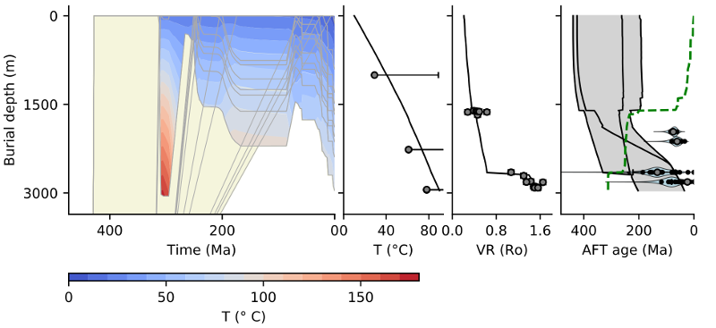
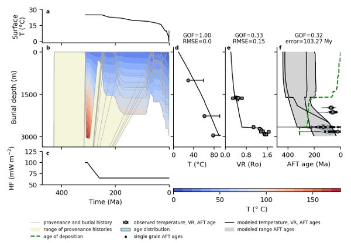

# PyBasin: Numerical model of basin history, heat flow and thermochronology

[](https://zenodo.org/badge/latestdoi/185432723)
[](https://github.com/ElcoLuijendijk/pybasin/actions/workflows/tests.yml)

PyBasin is an open-source basin model code that simulates sediment burial, compaction and thermal history. The modelled geological and thermal history can be compared to subsurface temperature, vitrinite reflectance data, the low-temperature thermochronometers fission track and (U-Th)/He. In addition, the model also simulates pore pressure and solute diffusion. The code includes support for setting up and running large series of model runs using parallel computing, which allows running large sets of models to explore parameter space and to quantify the values of exhumation rate, timing or basal heat flow that match subsurface temperature, vitrinite reflectance, thermochronological, salinity or pressure data. 



*Example model run showing provenance and basin burial and temperature history (left-hand panel) and modelled present-day subsurface temperature, vitrinite reflectance and apatite fission track ages.*


## Quickstart

The fastest way to run a model and to visualize results is the
notebook [notebooks/run_example_and_visualize.ipynb](notebooks/run_example_and_visualize.ipynb), which runs the first example dataset and plots the results. A second notebook, [notebooks/calibrate_exhumation.ipynb](notebooks/calibrate_exhumation.ipynb), shows how to calibrate a model parameter, such as exhumation magnitude, against thermochronology data.


## Getting started

* Click the download link on the right for a zip file of the source code or clone the repository
* Make sure you have installed the necessary python modules (see list below)
* Navigate to the directory where you have saved the code and execute PyBasin by executing the following command from the command line:

````sh
python pybasin.py
````
	
* Or alternatively run the model using one of the Jupyter notebooks: [notebooks/run_example_and_visualize.ipynb](notebooks/run_example_and_visualize.ipynb)
* The model will now run with the default input dataset from the Roer Valley Graben. Check the model output in the directory ``model_output/example_dataset_1``

## Dependencies

PyBasin requires the following Python packages:

- [Numpy](http://www.numpy.org/)
- [Pandas](https://pandas.pydata.org/)
- [Scipy](https://www.scipy.org/)
- [Matplotlib](https://matplotlib.org/)
- [Numba](https://numba.pydata.org/)
- [Xarray](https://xarray.dev/)

The easiest way to install all required packages is to use the included [environment.yml](environment.yml) file with conda or miniconda:

````sh
conda env create -f environment.yml
conda activate pybasin
````


### Example datasets

PyBasin contains four example datasets:

1. [input_data/example_dataset_1](input_data/example_dataset_1): Borehole vitrinite reflectance and apatite fission track data from the Roer Valley Graben in the southern Netherlands ([Luijendijk et al., 2011, JGR](https://agupubs.onlinelibrary.wiley.com/doi/10.1029/2010JB008071) and [Luijendijk 2012, PhD thesis](http://hdl.handle.net/1871/35433)).
2. [input_data/example_dataset_2](input_data/example_dataset_2): Apatite fission track and (U-Th)/He data from surface outcrops in the Molasse Basin in Switzerland ([von Hagke et al. 2012, Tectonics](http://doi.wiley.com/10.1029/2011TC003078)).
3. [input_data/example_dataset_3](input_data/example_dataset_3): Pore-water salinity data from a well in the Roer Valley Graben, demonstrating the solute diffusion model.
4. [input_data/example_dataset_4](input_data/example_dataset_4): Subsurface temperature and drill stem test pressure data from a well in the Gyda field, Norwegian Central Graben, demonstrating the compaction-driven fluid flow and excess pore pressure model.

You can run these example models using:

````sh
python pybasin.py input_data/example_dataset_1
````
and similarly for `example_dataset_2`, `example_dataset_3` or `example_dataset_4`.

The model runs will automatically generate figures of the modelled burial and thermal history and vitrinite reflectance, apatite fission track, apatite (U-Th)/He, salinity and/or pore pressure data, which can be found in the directory ``model_output/example_dataset_x``. The model result figure for the first example dataset should look like the figure below:


*Model result figure that is generated automatically if you run the first example dataset (input_data/example_dataset_1)*


## Manual
For more details on how to set up your own model runs see the manual, which is available as a [pdf file](manual/PyBasin_manual.pdf) in the subdirectory [manual](manual). 


## Fission track annealing speedup
* Optional: PyBasin includes a version of the fission track module that is written in Fortran instead of Python. The Fortran version runs faster than the Python version. However, the Fortran module needs to be compiled first to be able to use it. Compile the Fortran file by navigating to the subdirectory ``lib``, opening a terminal and running the following command:

````sh
f2py -c calculate_reduced_AFT_lengths.f90 -m calculate_reduced_AFT_lengths
````
	
* To use the Fortran version of the fission track annealing library you may need to install a fortran compiler first. For linux operating systems this should be included in your distribution, for Mac OSX you can find installers for Gfortran here: https://gcc.gnu.org/wiki/GFortranBinariesMacOS. I have not tested compiling Fortran code on windows systems. Note that you do not need to compile anything to model vitrinite reflectance and apatite (U-Th)/He data.


## Reference

Please cite the following paper if you publish work that uses PyBasin:

Luijendijk, E., R.T. Van Balen, M. Ter Voorde, P.A.M. Andriessen. 2011. Reconstructing the Late Cretaceous inversion of the Roer Valley Graben (southern Netherlands) using a new model that integrates burial and provenance history with fission track thermochronology. Journal of Geophysical Research 116 (B6). DOI:10.1029/2010JB008071 

The paper is available for free and can be found [here](https://doi.org/10.1029/2010JB008071).

A [bibtex file](references/10.1029%2F2010JB008071.bib) with the citation is included with the source code. 

The source code of PyBasin has also been published at Zenodo:
[](https://zenodo.org/badge/latestdoi/185432723)

[https://doi.org/10.5281/zenodo.4263427](https://doi.org/10.5281/zenodo.4263427)


## Authors
* **Elco Luijendijk**, <elco.luijendijk-at-uib.no>

## License
This project is licensed under the GNU lesser general public license (LGPL v3). See the [LICENSE.txt](LICENSE.txt) file for details.
