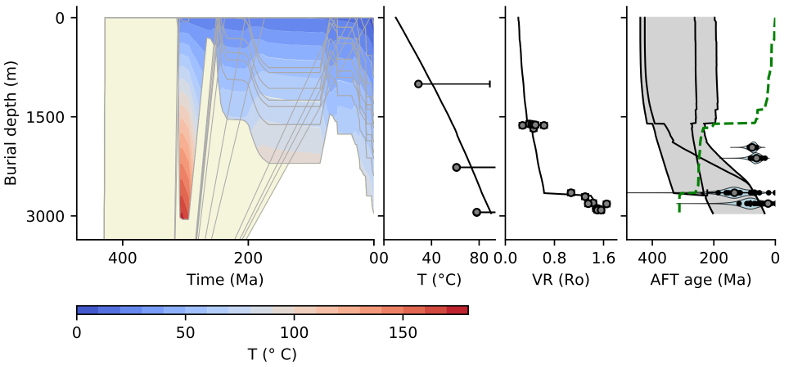

# PyBasin: Numerical model of basin history, heat flow and thermochronology

PyBasin is an open-source basin model code that simulates sediment burial, compaction and thermal history. The modelled geological and thermal history can be compared to vitrinite reflectance data and the low-temperature thermochronometers apatite fission track and (U-Th)/He. The code includes support for setting up and running large series of model runs using parallel computing, which allows running large sets of models to explore parameter space and to quantify the values of exhumation rate, timing or basal heat flow that match the data. 


*Example model run showing provenance and basin burial and temperature history (left-hand panel) and modelled present-day subsurface temperature, vitrinite reflectance and apatite fission track ages.*


## Getting started

* Click the download link on the right for a zip file of the source code or clone the repository
* Make sure you have installed the necessary python modules (see list below). The easiest is to use a python distribution that already includes all the necessary modules, like [Anaconda](https://www.continuum.io/downloads), [pythonxy](https://code.google.com/p/pythonxy/) or [canopy](https://www.enthought.com/products/canopy/).
* Navigate to the directory where you have saved the code and execute PyBasin by executing the following command from the command line:

````sh
python pybasin.py
````
	

* The model will now run with the default input dataset from the Roer Valley Graben. Check the model output in the directory ``model_output/example_dataset_1``
* Optional: PyBasin includes a version of the fission track module that is written in Fortran instead of Python. The Fortran version runs much faster than the relatively slow Python version. However, the Fortran module needs to be compiled first to be able to use it. Compile the Fortran file by navigating to the subdirectory ``lib``, opening a terminal and running the following command:

````sh
f2py -c calculate_reduced_AFT_lengths.f90 -m calculate_reduced_AFT_lengths
````
	

* To use the Fortran version of the fission track annealing library you may need to install a fortran compiler first. For linux operating systems this should be included in your distribution, for Mac OSX you can find installers for Gfortran here: https://gcc.gnu.org/wiki/GFortranBinariesMacOS. I have not tested compiling Fortran code on windows systems. Note that you do not need to compile anything to model vitrinite reflectance and apatite (U-Th)/He data.


## Dependencies

PyBasin requires the following Python packages:

- [Numpy](http://www.numpy.org/)
- [Pandas](https://pandas.pydata.org/)
- [Scipy](https://www.scipy.org/)
- [Matplotlib](https://matplotlib.org/)


### Example datasets

PyBasin contains two example datasets, one dataset with borehole vitrinite reflectance and apatite fission track data from the Roer Valley Graben in the southern Netherlands that can be found in the directory [input_data/example_dataset_1](input_data/example_dataset_1) ([Luijendijk et al., 2011, JGR](https://agupubs.onlinelibrary.wiley.com/doi/10.1029/2010JB008071) and [Luijendijk 2012, PhD thesis](http://hdl.handle.net/1871/35433)) and a second dataset that contains apatite fission track and (U-Th)/He data from surface outcrops from the Molasse Basin in Switzerland that can be found in the directory [input_data/example_dataset_2](input_data/example_dataset_2) ([von Hagke et al. 2012, Tectonics](http://doi.wiley.com/10.1029/2011TC003078)). You can run these example models using:

````sh
python pybasin.py input_data/example_dataset_1
````
and
````sh
python pybasin.py input_data/example_dataset_2
````

The model runs will automatically generate figures of the modelled burial and thermal history and vitrinite reflectance, apatite fission track and/or apatite (U-Th)/He data, which can be found in the directory ``model_output/example_dataset_x``. The model result figure for the first example dataset should look like the figure below:


*Model result figure that is generated automatically if you run the first example dataset (input_data/example_dataset_1)*


## Manual

For more details on how to set up your own model runs see the manual, which is available in [markdown format](manual/PyBasin_manual.md) or as a [pdf file](PyBasin_manual.pdf) in the subdirectory [manual](manual). 


## Reference

Please cite the following paper if you publish work that uses PyBasin:

Luijendijk, E., R.T. Van Balen, M. Ter Voorde, P.A.M. Andriessen. 2011. Reconstructing the Late Cretaceous inversion of the Roer Valley Graben (southern Netherlands) using a new model that integrates burial and provenance history with fission track thermochronology. Journal of Geophysical Research 116 (B6). DOI:10.1029/2010JB008071 

The paper is available for free and can be found [here](https://agupubs.onlinelibrary.wiley.com/doi/full/10.1029/2010JB008071).

A [bibtex file](references/10.1029%2F2010JB008071.bib) with the citation is included with the source code. 


## Authors
* **Elco Luijendijk**, <elco.luijendijk-at-geo.uni-goettingen.de>

## License
This project is licensed under the GNU lesser general public license (LGPL v3). See the [LICENSE.txt](LICENSE.txt) file for details.
